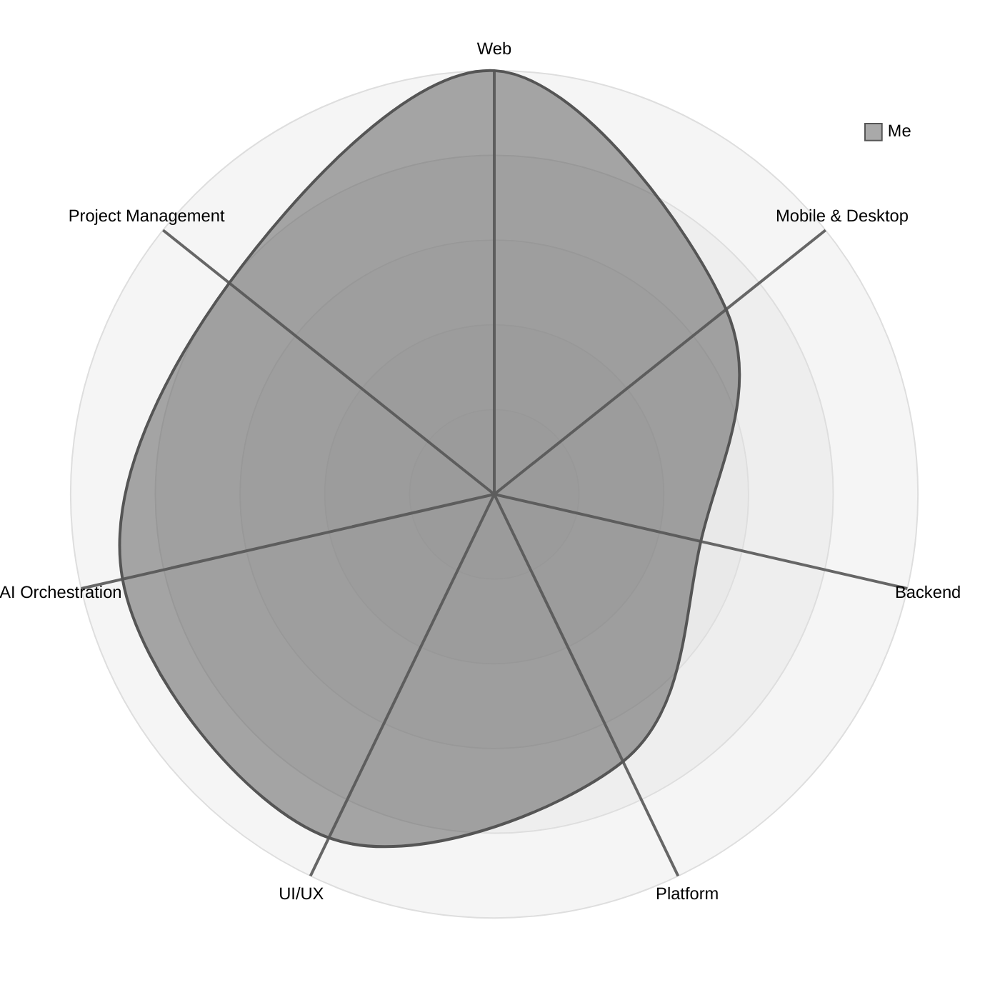

  

 

<i><b>Hi, and welcome to my GitHub!</b></i>

I’m Matthieu Vagnon, a detail-oriented, creative full-stack developer passionate about AI workflows and automations.

  
  

---

## Personal Projects

### Current

- 2026 &bull; **⚡️ [zapdev](https://github.com/mvagnon/zapdev)** &bull; Fast, performant and lightweight git chores and dev tools using your terminal and your own local LLM.
- 2026 &bull; **📊 Family-Fi** &bull; The money manager SaaS. Built for families.
- 2026 &bull; **🌸 Iki Hub** &bull; The application library.
- 2026 &bull; **🌐 [Portfolio](https://github.com/mvagnon/mvagnon-portfolio)** &bull; Personal web portfolio.

### Deprecated

- 2026 &bull; **[Plan Based Agentic Workflow](https://github.com/mvagnon/plan-based-agentic-workflow)** &bull; Why: not needed anymore, but feel free to fork.
- 2025 &bull; **[mvagnon/agents](https://github.com/mvagnon/agents)** &bull; Why: `chezmoi` partially replaces this.
- 2025 &bull; **[Personal Dashboard](https://github.com/mvagnon/personal-dashboard)** &bull; Why: skills system replaces this.
- 2025 &bull; **[Portfolio](https://github.com/mvagnon/portfolio)** &bull; Why: [here is the new porfolio](https://github.com/mvagnon/mvagnon-portfolio).

## Contact Me

- By email: [hi@mvagnon.dev](mailto:hi@mvagnon.dev)
- On WhatsApp: [Contact Me!](https://wa.me/817090997140?text=Bonjour%20%2F%20Hi%20%2F%20%E3%81%93%E3%82%93%E3%81%AB%E3%81%A1%E3%81%AF%20Matthieu%2C%0A%0AI%E2%80%99m%20interested%20in%20your%20expertise%20in%3A%0A-%20software%20engineering%0A-%20AI%20workflows%0A%0AHere%E2%80%99s%20what%20I%20need%20help%20with%3A)

---

<i><b>My (honest) developer profile</b></i>

